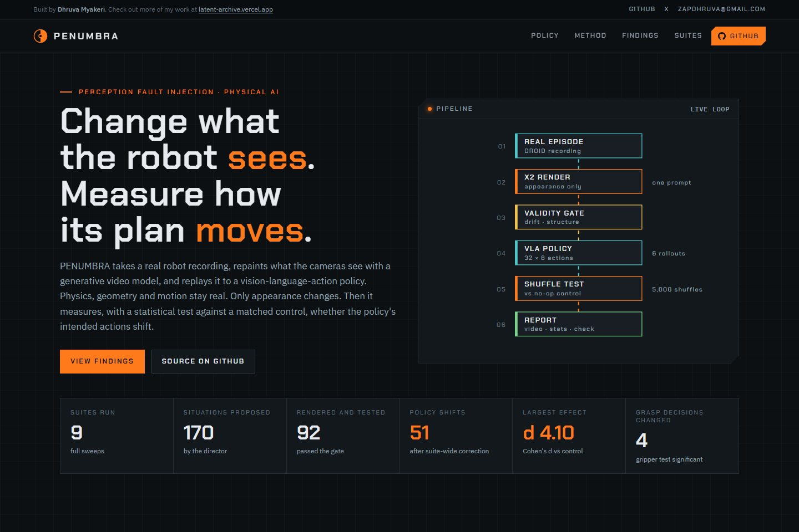
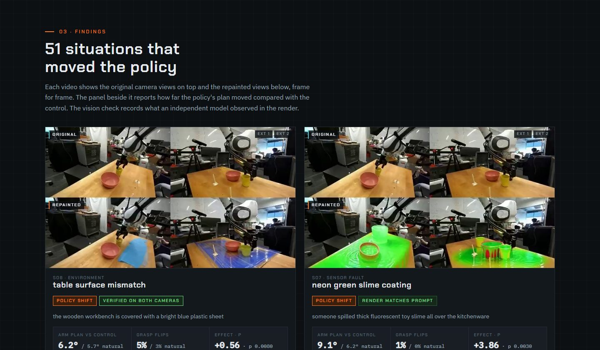
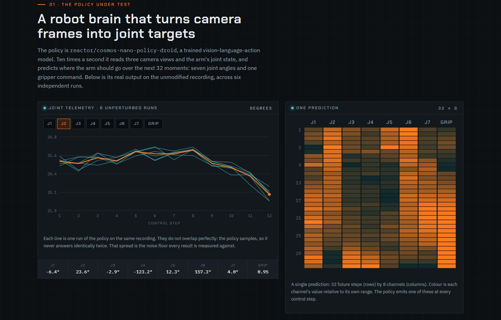
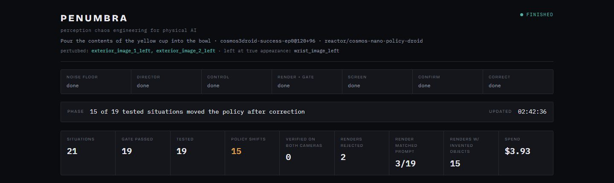

# PENUMBRA

**Perception fault injection for physical AI.** Change what a robot sees, keep everything else real, and measure how its plan moves.

<sub>Built by **Dhruva Myakeri** · more of my work at [latent-archive.vercel.app](https://latent-archive.vercel.app) · [GitHub](https://github.com/DhruvaMyakeri) · [X](https://x.com/LatentDhruva) · zapdhruva@gmail.com</sub>



PENUMBRA takes a real robot recording, repaints what the cameras see with a generative video model, and replays the result to a vision-language-action policy. Physics, geometry, camera motion and the robot's own trajectory all come from the recording, so the only thing that changes is appearance. It then asks a precise question: **did the policy's intended actions shift, beyond its own run-to-run variation, compared with a matched control?**

**[Open the live showcase](https://dhruvamyakeri.github.io/Penumbra/)**: every suite, every policy shift, with the original and repainted camera views side by side and the measured change in the policy's plan.

---

## What a run looks like



Each result pairs the render the policy actually saw with how far its plan moved: arm-plan disagreement against the control in degrees next to the policy's natural wobble, how often the grasp decision flipped, the effect size, and a permutation-test p-value.



The policy under test is `reactor/cosmos-nano-policy-droid`. At every control step it reads three camera views and the arm's joint state and predicts the next 32 steps of seven joint angles plus a gripper command. Six runs on the same untouched recording never agree exactly. That spread is the noise floor every result is measured against.



Suites stream to a live console while they run: pipeline stage, render and gate verdicts per camera, rollouts, and cost.

---

## Results at a glance

Across 9 completed suites on a real DROID episode ("pour the contents of the yellow cup into the bowl"):

| | |
|---|---|
| Situations proposed | **170** |
| Rendered, gated and tested | **92** |
| Situations that shifted the policy | **51**, after Benjamini-Hochberg correction within each suite |
| Median effect size | **d = 1.57** (range 0.26 to 4.10) |
| Largest shift | **d = 4.10**: arm plan 10.7° from the control against 7.8° of natural variation |
| Grasp decisions changed | **4 situations**: the gripper command flipped on 5.6% to 8.3% of steps, against 0% between control runs |
| Total compute | **$19.28** for rendering and policy rollouts |

Details, including how each number is computed and what it does and does not cover, are in [docs/RESULTS.md](docs/RESULTS.md).

---

## How it works

```
real robot episode (DROID)
   -> director       an LLM looks at the actual workspace and proposes situations
   -> X2 render      each situation is painted onto the camera views; motion stays real
   -> validity gate  optical-flow drift, structure and temporal checks reject renders
                     that moved the scene instead of repainting it
   -> vision check   an independent model records what each render actually shows,
                     camera by camera
   -> VLA policy     6 rollouts on the render, 6 on a no-op re-render (the control)
   -> shuffle test   5,000 label permutations on arm trajectory and grasp decision
   -> report         per-situation video, statistics, verification, and a run summary
```

Three design choices carry most of the weight:

- **A no-op control.** Every situation is compared against the same episode re-rendered with a prompt asking for no change, not against the raw recording. Anything the video model does to every clip lands on both sides and cancels.
- **Groups, not pairs.** The policy samples, so it never answers identically twice. A single before-and-after comparison proves nothing; groups of rollouts and a permutation test do.
- **Measured thresholds.** The validity gate's bars were calibrated by shifting the real footage by known amounts, not chosen.

The full method is in [docs/METHODOLOGY.md](docs/METHODOLOGY.md) and the system design in [docs/ARCHITECTURE.md](docs/ARCHITECTURE.md).

---

## Quickstart

Requires Python 3.10+, a [Reactor](https://reactor.inc) API key, and optionally a Gemini API key for the director, render agent and vision check.

```bash
python -m venv .venv
.venv/Scripts/pip install -e .          # Windows; use .venv/bin/pip elsewhere
cp .env.example .env                    # then fill in REACTOR_API_KEY and GEMINI_API_KEY

python tools/fetch_droid.py             # downloads the nvidia/Cosmos3-DROID episode used here
```

Run a suite with a live dashboard:

```bash
python tools/garage.py --episode 0 --scenarios 21 \
  --views exterior_image_1_left,exterior_image_2_left
```

Open **http://127.0.0.1:8765** (include the `http://`). A 21-situation suite takes about three hours and a few dollars.

Reopen any finished run without spending anything:

```bash
python tools/view.py runs/garage-ep0-<timestamp>
```

Rebuild the showcase from your own runs:

```bash
python tools/build_demo.py              # writes demo/assets/
```

Tests run offline, with no credentials:

```bash
python -m pytest tests/
```

---

## Repository layout

```
src/penumbra/
  episodes/      DROID loader: camera views, proprioception, logged actions
  reactor/       Reactor session handling and transport retry
  perturbation/  X2 adapter, classical augmentation operators, fault specs
  policy/        cosmos-nano-policy-droid adapter (teacher-forced replay), trace cache
  validation/    SEAM validity gate
  evaluation/    divergence metrics, permutation test, multiple-comparison correction
  scenarios/     director, render agent, vision check, insight ledger, suite runner
  search/        strength bisection
  report/        per-situation and per-run reports
  ui/            live and replay dashboard
tools/           suite runner, viewer, calibration and audit scripts, demo builder
tests/           offline unit tests
demo/            the static showcase and its media
docs/            architecture, methodology, results, Reactor capability report
```

---

## Scope

PENUMBRA measures a policy's **intended actions** in open-loop replay: the robot is never allowed to act on its predictions, so results describe changes in the plan rather than task outcomes. The published results come from one recorded episode and one policy. Situation names describe the edit that was requested; the vision check on each result records what the render showed.

---

## Author

**Dhruva Myakeri** · [latent-archive.vercel.app](https://latent-archive.vercel.app) · [github.com/DhruvaMyakeri](https://github.com/DhruvaMyakeri) · [x.com/LatentDhruva](https://x.com/LatentDhruva) · zapdhruva@gmail.com
